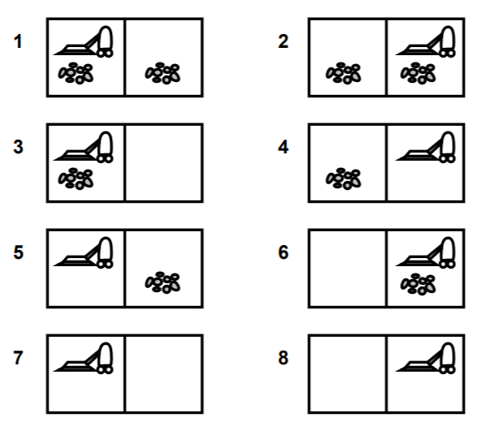
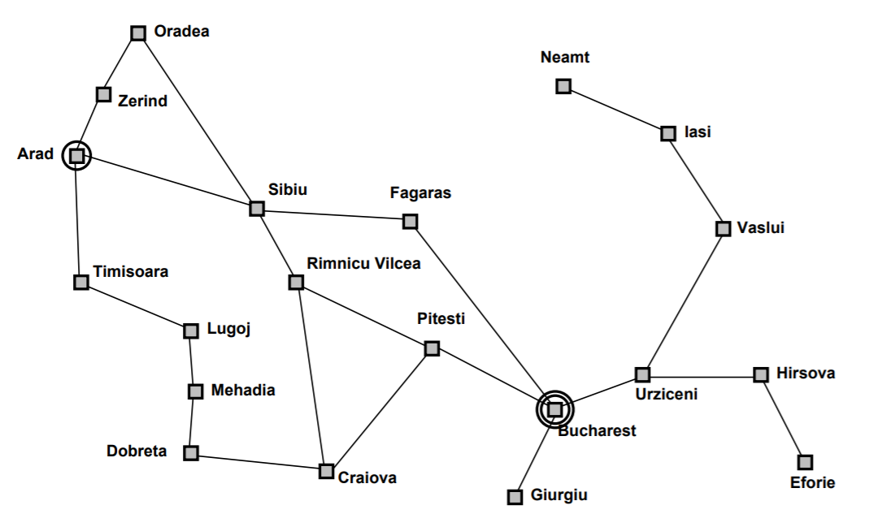

# CH2 Problem solving and search

[toc]

## Problem Solving

### Formulating problems

A problem can be defined formally by 5 components:

1. The **initial state** that agent start in.
2. A description of the possible **actions** available to the agent.
3. A **transition model**, which is a description of what each action does
4. The **goal test**, which determines whether a given state is a goal state.
5. A **path cost** function that assigns a numeric cost to each path. The problem-solving agent choose a cost function that reflects its own performance measure.

> *1-3 can implicitly define the **state space***

### Types of Problem

+ Offline problem solving: Acting only with complete knowledge of problem and solution
+ Online problem solving: Acting without complete knowledge

**Online algorithm** 是一種處理輸入資料的獨特形式，其演算過程中並不要求所有輸入資料在演算法開始運始之一刻即完備，反而可對逐步輸入的資料加以處理並在輸入完最後一項資料之後輸出運算結果。與之相對的稱為**Offline algorithm** 則假設輸入資料在運算開始前已完備。舉例：[選擇排序](https://zh.wikipedia.org/wiki/選擇排序)是offline algorithm，而[插入排序](https://zh.wikipedia.org/wiki/插入排序)則為online algorithm。

---

+ Single-state problem: deterministic, accessible

  > 有一個初始狀態和最後的目標 (比如掃地機器人從第5個狀態出發，目標是清除垃圾)
  >
  > **state -** is known exactly after any sequence of actions
  > **accessibility** of the world all essential information can be obtained through sensors
  > **consequences** of actions are known to the agent
  > **goal -** for each known initial state, there is a unique goal state that is guaranteed to be reachable via an action sequence
  > <u>simplest case, but severely restricted</u>

+ Multiple-state problem: deterministic, inaccessible (Partially observable)

  > 已知有多種狀態，但不確定初始狀態是哪一個
  >
  > **state** is *not* known exactly, but limited to a set of possible states after each action
  > **accessibility** of the world *not* all essential information can be obtained through sensors reasoning can be used to determine the set of possible states
  > **consequences** of actions are not always or completely known to the agent; actions or the environment might exhibit randomness
  > **goal** due to ignorance, there may be no fixed action sequence that leads to the goal
  >
  > <u>less restricted, but more complex</u>

+ Contingency problem (偶然性問題): nondeterministic, inaccessible. (Must use sensors during execution)

  > **state** unknown in advance, may depend on the outcome of actions and changes in the environment
  > **accessibility** of the world some essential information may be obtained through sensors only at execution time
  > **consequences** of action may not be known at planning time
  > **goal** instead of single action sequences, there are *trees of actions*
  > **contingency** branching point in the tree of actions
  > **agent design** different from the previous two cases: the agent must act on incomplete plans
  >
  > <u>search and execution phases are interleaved</u>

+ Exploration problem (探索性問題)

### Example

1. 八皇后問題

   8-queens problem: 8個皇后棋擺在棋盤上其中一直行與一橫行沒有其他皇后棋，這個問題有兩種 formulation，而這兩種 case 都不考慮 path cost ，因為在這裡我們只在乎終局的數量

   **incremental formulation** involves operators that augment the state description, starting with an empty state

   + **State:** any arrangement of 0 to 8 queens on the board is a state.
   + **Initial state:** No queens on the board
   + **Actions:** Add a queen to any empty square.
   + **Transition model:** Returns the board with a queen added to the specified square
   + **Goal test:** 8 queens are on the board, none attacked.
   + **Path cost**: 不考慮

   A **complete-state formulation** starts with all 8 queens on the board and moves them around.

   + **State:** All possible arrangements of $n$ queens ($0\le n\le 8$), one per column in the leftmost $n$ columns, with no queen attacking another.
   + **Actions:** Add a queen to any square in the leftmost empty column s.t. it is not attacked by any other queen.

2. 掃地機器人問題

   + **State:** The state is determined by both the agent location and the agent is in one of two locations. i.e., 8 possible world states.
   + **Initial state:** Any state can be designed as the initial state.
   + **Actions:** In this simple environment, each state has just 3 actions: *Left*, *Right*, and *Suck*. Larger environments might also include *Up* and *Down* 
   + **Transition model:** The actions have their expected effects, expect that moving *Left* in the leftmost square, moving *Right* in the rightmost square, and *Sucking* in a clean square have no effect.
   + **Goal test:** This checks whether all the squares are clean.
   + **Path cost:** Each step costs 1, so the path cost is the number of steps in the path.

   + Single-state problem: 會有初始狀態做考慮比如第 5 個情況
   + Multiple-state problem: 則會從這 8 種情況都進行考慮 (沒有sensor不確定初始狀態)
   + Contingency state problem: There is no action sequence that can be calculated at planning time and is guaranteed to reach the goal state.

   

3. 羅馬尼亞旅遊問題

   + Scenario: On holiday in Romania; currently in Arad Flight leaves tomorrow from Bucharest
   + Goal: Be in Bucharest
   + Formulate problem: 
     + **States:** various cities 
     + **Actions:** drive between cities
   + Solution Appropriate sequence of cities
     + e.g., Arad, Sibiu, Fagaras, Bucharest

*Reference:*

1. http://aimaterials.blogspot.com/p/problem-solving-agent_11.html

## Search for Solution

### Search algorithm

+ **Uninformed search** aka **blind search**
  Search strategies: breadth-first, uniform-cost, depth-first, bi-directional, ...
+ **Informed search**
  Search strategies: best-first, A\* Heuristic

### Evaluation of search strategies

1. **Completeness**: Is the algorithm guaranteed to find a solution when there is one?
2. **Optimality**: Does the strategy find the optimal solution?
3. **Time Complexity**: How long does it take to find a solution?
4. **Space Complexity**: How much memory is needed to perform the search?

在分析一個問題時可以將其狀態以決策樹繪出去估算，空間複雜度上我們會常透過 $|V|+|E|$ ($V$ is the set of vertices, $E$ is the set of edges) 表示，但在人工智慧領域，有時樹時無限增長的，所以會用 *b: branch factor, the maximum number of successors of any node* 及 *d: depth of the shallowest goal node* 來計算

1. Polynomial-time problems (P)
   e.g. sort n numbers into increasing order, poor algorithms have $n^2$ complexity, better one have $nlogn$ complexity

2. nondeterministic-polynomial-time (NP)

   無法在多項式時間找到答案，但能在多項式時間內驗證猜測的答案

   e.g. traveling salesman problem. In particular, exponential-time algorithms are believed to be NP.

3. NP-complete hardest NP problems; 

   if one of them can be proven to be P, then NP = P

### Complexity: Big Oh and Little Oh measures

**little Oh**
$$
o(g(n)):\{f(n)\ |\ \forall c>0, \exist k>0\ and\ k\le n\ s.t.\ 0\le f(n)\textcolor{blue}<cg(n)\}
$$
**big Oh**
$$
O(g(n)):\{f(n)\ |\ \forall c>0, \exist k>0\ and\ k\le n\ s.t.\ 0 \le f(n)\textcolor{blue}{\le}cg(n)\}
$$

